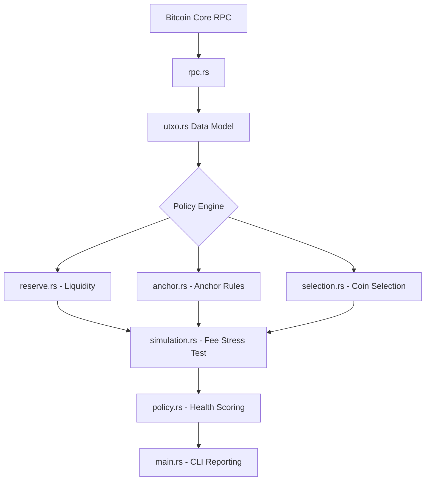

# ⚡ Lightning UTXO & Anchor Manager (Rust)

A robust Rust library and CLI tool for analyzing and managing Bitcoin UTXOs specifically for Lightning nodes using **anchor channels**. This project acts as a **Wallet Policy Intelligence Layer**, ensuring nodes maintain the necessary on-chain liquidity for safe operation.

   

---

## 🔍 Why This Matters

Lightning nodes do not manage on-chain funds automatically. Poor UTXO management often leads to:
- **Failed Channel Opens**: Insufficient confirmed funds or fragmented UTXOs.
- **Stuck Force-Closes**: Commitment transactions with fees too low to confirm during spikes.
- **Liquidity Lockup**: Lack of available UTXOs for emergency fee bumping (CPFP).

This tool solves these issues by providing a **pre-flight diagnostic** for your node's wallet.

---

## 🚀 Key Features

### 🛡️ Core UTXO Analysis
- **Advanced Classification**: Categorizes coins as *Spendable*, *Anchor-Capable* (>= 40k sats), or *Reserved*.
- **Fragmentation Detection**: Identifies when a wallet has too many small UTXOs ("dust") that could spike transaction costs.
- **Safe Selection**: Greedy algorithm for selecting the best UTXOs for channel funding while preserving anchor reserves.

### 📈 Risk Simulation
- **Fee Spike Modeling**: Simulates mempool congestion (up to 500 sat/vB) to verify if your anchor UTXOs can still cover CPFP costs.
- **Safety Scoring**: Provides a 1-100 "Health Score" based on current wallet liquidity vs. estimated operational risks.

### 🔌 Integration Layer
- **Modular Library**: Designed to be integrated into LDK, LND, or Core Lightning node management stacks.
- **Bitcoin RPC Support**: Direct integration with `bitcoin-cli` for real-time wallet analysis.

---

## 🏗️ System Architecture

The project follows a modular, policy-driven architecture:



---

## 🛠️ Quick Start

### 1. Requirements
- Rust 1.70+
- `bitcoin-cli` (configured for Signet or Mainnet)

### 2. Installation
```bash
git clone https://github.com/Ugarba202/Lightning-UTXO-Anchor-Manager.git
cd lighting_utxo_anchor_manager
cargo build --release
```

### 3. Usage
```bash
# Perform a full wallet health analysis
cargo run -- analyze

# Simulate a high-fee environment (e.g., 250 sat/vB)
cargo run -- simulate --feerate 250
```

---

## 📋 Example Output

```text
⚡ Lightning Node UTXO Health Report
------------------------------------
Total UTXOs: 14
Spendable: 9
Anchor Capable: 4 (Total: 1.2M sats)

Analysis:
- Max Safe Channel Size: 0.08 BTC
- Safe Under 150 sat/vB: YES
- Wallet Distribution: HEALTHY

Risk Status: SAFE
```

---

## 🗺️ Roadmap & Future Work

We are aiming to align with the latest developments in the Lightning protocol:

### Phase 1: V3 & Ephemeral Anchors (Next)
- [ ] **TRUC/V3 Support**: Implement simulation for 0-value ephemeral anchors (BOLT V3).
- [ ] **Package Relay**: Construct mock parent+child packages for more accurate fee estimation.

### Phase 2: Privacy & Automation
- [ ] **Privacy Scoring**: Avoid UTXO selection patterns that leak node ownership.
- [ ] **Automated Consolidation**: Suggest specific transactions to merge small UTXOs during low-fee windows.

### Phase 3: Hardware & API
- [ ] **BDK Integration**: Move from `bitcoin-cli` to a native BDK-based wallet.
- [ ] **JSON Export**: Support for Prometheus/Grafana monitoring dashboards.

---

## 🤝 Contributing

Contributions are welcome! Please follow these steps:
1. Fork the repository.
2. Create a feature branch (`git checkout -b feature/amazing-feature`).
3. Commit your changes (`git commit -m 'feat: add some amazing feature'`).
4. Push to the branch (`git push origin feature/amazing-feature`).
5. Open a Pull Request.

---

## 📄 License

MIT License. See [LICENSE](LICENSE) for details.

---

Built by **Usman Umar Garba** | *Bitcoin & Lightning Infrastructure Engineer*